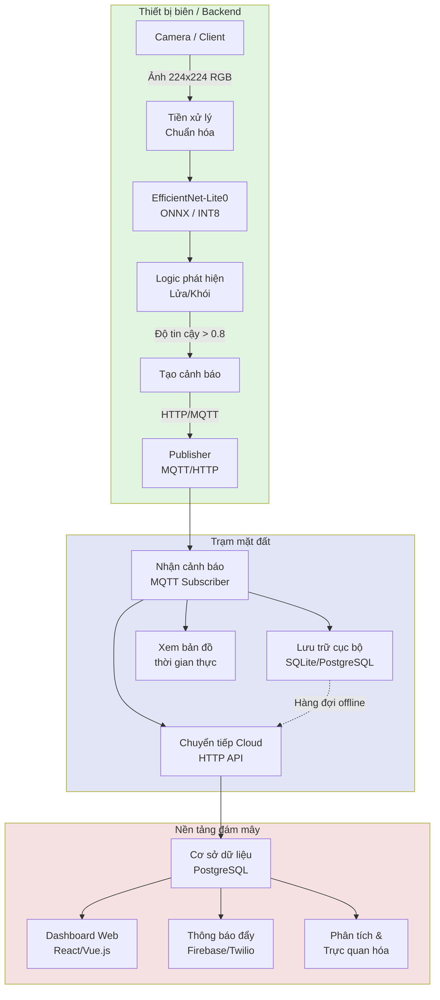

# Hệ thống phát hiện cháy rừng bằng Edge AI

> Phát hiện cháy rừng tự động bằng Edge AI với khả năng cảnh báo thời gian thực

## Tổng quan

Dự án triển khai hệ thống phát hiện cháy rừng thông minh, tận dụng Edge AI để phát hiện lửa và khói theo thời gian thực trực tiếp trên thiết bị biên (hoặc backend). Hệ thống xử lý khung hình camera bằng mô hình EfficientNet-Lite (có thể lượng tử hóa), không cần truyền video liên tục lên đám mây. Khi phát hiện lửa hoặc khói, cảnh báo được gửi tới trạm mặt đất và chuyển tiếp lên nền tảng đám mây để hiển thị, thông báo và phân tích lịch sử.

**Điểm nổi bật**: Chạy suy luận tại thiết bị biên/backend thay vì streaming video lên server đám mây, hệ thống đạt độ trễ rất thấp (2–5 giây), sử dụng băng thông tối thiểu (chỉ gửi cảnh báo, không gửi video) và có thể hoạt động ngoại tuyến — quan trọng cho giám sát rừng ở vùng xa.

---

## Tổng hợp nội dung đồ án (Project Summary)

Phần này tóm tắt toàn bộ nội dung đồ án từ đầu đến thời điểm hiện tại.

### 1. Tên và mục tiêu đồ án

- **Tên**: Hệ thống phát hiện cháy rừng thời gian thực dựa trên Edge AI và triển khai backend container.
- **Mục tiêu chính**:
  - Xây dựng mô hình phân loại ảnh **fire / normal** (hai lớp) đạt độ chính xác cao.
  - Triển khai mô hình trên **backend C++** (ONNX Runtime), lượng tử INT8 (mục tiêu mất mát accuracy &lt; 2%), export ONNX và đóng gói **Docker** (kích thước nhỏ).
  - Kiến trúc end-to-end: Backend suy luận → Trạm mặt đất → Nền tảng đám mây (MQTT/HTTP, dashboard, thông báo).

### 2. Kiến trúc hệ thống

- **Backend suy luận (C++/ONNX)**: Dịch vụ HTTP (cổng 8080) nhận ảnh 224×224 RGB (raw 150528 byte hoặc base64), chạy mô hình EfficientNet-Lite0 (ONNX), trả JSON `{"class":"fire"|"normal","confidence":float}`. Có thể triển khai tại biên hoặc server, đóng gói bằng Docker multi-stage.
- **Trạm mặt đất**: Nhận cảnh báo qua MQTT/HTTP, lưu trữ, hiển thị bản đồ, chuyển tiếp lên cloud (thiết kế trong `ground_station/`).
- **Nền tảng đám mây**: Lưu trữ cảnh báo, dashboard web, gửi thông báo (thiết kế trong `cloud/`).

### 3. Mô hình và huấn luyện

- **Kiến trúc**: **EfficientNet-Lite0** (timm), pretrained ImageNet, fine-tune 2 lớp (fire, normal).
- **Hai phương pháp đã thực hiện**:
  1. **Huấn luyện cơ sở (baseline)**: Fine-tune trực tiếp EfficientNet-Lite0 với Cross-Entropy; checkpoint `fire_detection_best.pth`.
  2. **Huấn luyện student (knowledge distillation)**: Teacher EfficientNet-B3 → student EfficientNet-Lite0 với loss CE + KL; checkpoint `experiments/knowledge_distillation/models/student_distilled_best.pth`.
- **Lựa chọn đồ án**: **Chỉ sử dụng một phương pháp — huấn luyện cơ sở** và mô hình `fire_detection_best.pth`.
- **Lý do và kết quả chứng minh** (từ checkpoint):
  - Cả hai đều đạt **validation accuracy 98,5%**.
  - **Validation loss**: baseline **0,156** vs distillation **0,463** (thấp hơn = ổn định hơn).
  - Baseline: 1 giai đoạn, đơn giản, tiết kiệm tài nguyên; distillation: 2 giai đoạn (teacher + student), tốn thêm GPU/thời gian.
  - Cùng kiến trúc Lite0 nên kích thước và độ trễ triển khai giống nhau → không có lợi thế triển khai khi chọn distillation trong trường hợp này.

### 4. Pipeline từ huấn luyện đến triển khai

1. **Dữ liệu**: `model/data/fire_dataset/` (train/val, fire/normal); tổ chức bằng `model/organize_dataset.py`.
2. **Huấn luyện**: `model/train_fire_detection.py` (batch 32, 20 epochs, Adam, CosineAnnealing) → lưu `fire_detection_best.pth`.
3. **Lượng tử và export**: `quantize_int8.py` — load checkpoint, thử dynamic INT8 (nếu môi trường hỗ trợ), kiểm tra accuracy drop &lt; 2%; export ONNX và TorchScript vào `app/model/` (`fire_detection.onnx`, `fire_detection_scripted.pt`). Trên một số môi trường (ví dụ Python 3.13, thiếu kernel quantized) script fallback FP32 nhưng vẫn export ONNX.
4. **Backend C++**: `app/` — CMake + ONNX Runtime, `src/main.cpp` (HTTP server, preprocess ImageNet, inference), `include/preprocess.h`. Build: `cd app/build && cmake .. && make`. Chạy: `./fire_backend /path/to/fire_detection.onnx`.
5. **Container**: `app/Dockerfile` — multi-stage build (Ubuntu + ONNX Runtime), image runtime nhỏ, EXPOSE 8080. Chạy với volume mount `app/model` chứa file ONNX.

### 5. Chứng minh tương thích thiết bị biên / backend

- Script **`edge_compatibility_comparison.py`** (tiếng Anh): đọc checkpoint baseline và student, cấu hình từ `model/train_fire_detection.py` và `experiments/knowledge_distillation/config.py`, so sánh:
  - Kiến trúc (EfficientNet-Lite0 hay không),
  - Số tham số, kích thước FP32/INT8, RAM suy luận,
  - Epochs, batch size, validation accuracy/loss,
  - Kết luận tương thích triển khai (backend/container).
- Kết quả chi tiết ghi vào **`comparison_report.md`**. Chạy: `python edge_compatibility_comparison.py`.

### 6. Cấu trúc repo chính (liên quan đồ án)

| Thành phần | Mô tả ngắn |
|------------|------------|
| `fire_detection_best.pth` | Checkpoint mô hình được chọn (baseline, EfficientNet-Lite0) |
| `model/train_fire_detection.py` | Script huấn luyện cơ sở (Lite0, 2 lớp) |
| `model/test_trained_model.py` | Kiểm thử mô hình trên ảnh |
| `quantize_int8.py` | Lượng tử INT8, export ONNX/TorchScript vào `app/model/` |
| `app/` | Backend C++ (ONNX Runtime), Dockerfile, `preprocess.h`, `main.cpp` |
| `app/model/` | Thư mục chứa `fire_detection.onnx` (sau khi chạy quantize_int8.py) |
| `experiments/knowledge_distillation/` | Thí nghiệm distillation (teacher B3, student Lite0); đồ án không chọn phương pháp này |
| `edge_compatibility_comparison.py` | So sánh chi tiết baseline vs student, sinh `comparison_report.md` |
| `comparison_report.md` | Báo cáo so sánh (kiến trúc, kích thước, RAM, cấu hình, accuracy/loss) |
| `report.tex` | Báo cáo đồ án LaTeX (5 chương, tiếng Việt, đã bỏ phần ESP, thêm INT8/export/backend/container) |
| `EDGE_EVALUATION.md` | Tài liệu đánh giá triển khai edge |

### 7. Kết quả chính (tại thời điểm hiện tại)

- **Validation accuracy**: 98,5% (mô hình baseline `fire_detection_best.pth`).
- **Validation loss**: 0,156 (baseline) so với 0,463 (student distilled) — đồ án chọn baseline.
- **Kiến trúc triển khai**: EfficientNet-Lite0, ~5,3 MB INT8, ~1,5 MB RAM suy luận, phù hợp backend/container.
- **Export**: ONNX và TorchScript cho backend C++; Docker image cho dịch vụ inference nhỏ gọn.
- **Báo cáo**: `report.tex` tổng hợp lý do chọn huấn luyện cơ sở, so sánh hai phương pháp, INT8, export, backend C++, Docker và các khía cạnh chứng minh tương thích thiết bị biên/backend.

---

## Kiến trúc hệ thống



## Tại sao chọn EfficientNet-Lite thay vì ResNet?

Lựa chọn kiến trúc mô hình rất quan trọng để triển khai thành công trên thiết bị biên có tài nguyên hạn chế.

### So sánh mô hình

| Mô hình | Kích thước | RAM | Độ trễ FP32 | Độ trễ INT8 | Phù hợp thiết bị biên |
|---------|------------|-----|-------------|-------------|------------------------|
| ResNet18 | 44 MB | 15 MB | 180 ms | 90 ms | ❌ Quá lớn |
| ResNet50 | 98 MB | 35 MB | 350 ms | 175 ms | ❌ Quá lớn |
| MobileNetV2 | 14 MB | 3 MB | 45 ms | 25 ms | ⚠️ Giới hạn |
| MobileNetV3-Small | 5,5 MB | 2 MB | 35 ms | 18 ms | ✅ Tốt |
| **EfficientNet-Lite0** | **5,3 MB** | **1,5 MB** | **40 ms** | **22 ms** | **✅ Tối ưu** |
| EfficientNet-Lite1 | 7,8 MB | 2,5 MB | 65 ms | 35 ms | ⚠️ Chậm hơn |

### Vì sao EfficientNet-Lite0 tối ưu

1. **Kích thước mô hình**: ~5 MB so với 44 MB của ResNet18 — vừa bộ nhớ flash 4–16 MB của nhiều thiết bị biên; ResNet đòi hỏi phần cứng đắt tiền (Jetson Nano, RPi 4).
2. **Bộ nhớ**: 1–2 MB RAM khi lượng tử INT8 — đủ cho triển khai backend/container; ResNet18 cần 10–15 MB.
3. **Tốc độ suy luận**: Thiết kế cho thiết bị biên — toán tử tối ưu cho mobile, ~20–40 ms mỗi khung hình; ResNet không tối ưu cho suy luận trên thiết bị nhúng.
4. **Độ chính xác**: Compound scaling — đạt độ chính xác tương đương với ít tham số hơn nhiều, cân bằng depth/width/resolution.
5. **Thân thiện lượng tử**: Tối ưu sẵn cho INT8 — EfficientNet-Lite thiết kế cho lượng tử sau huấn luyện, mất mát độ chính xác thường &lt;2%; ResNet cần quantization-aware training cẩn thận.

### Hạn chế của ResNet cho thiết bị biên

- **Kích thước**: Mô hình 44+ MB không vừa flash ESP32 thông thường.
- **Bộ nhớ**: Nhu cầu RAM 15+ MB vượt PSRAM 8 MB của ESP32-S3.
- **Chi phí**: Cần thiết bị đắt tiền (100–300 USD), làm giảm lợi ích triển khai biên.
- **Điện năng**: Nhu cầu tính toán cao hơn làm tăng tiêu thụ điện.
- **Tối ưu hóa**: Không thiết kế cho suy luận mobile/edge.

**Kết luận**: EfficientNet-Lite0 mang lại sự cân bằng tốt nhất giữa độ chính xác, tốc độ và hiệu quả tài nguyên cho triển khai backend/thiết bị biên, giúp phát hiện cháy rừng thời gian thực khả thi trên thiết bị chi phí thấp.

## Yêu cầu phần cứng

### Thiết bị biên / Backend
- **Backend inference**: Server hoặc container chạy C++/ONNX Runtime; có thể triển khai trên Raspberry Pi, server local hoặc cloud.
- **Camera/Client**: Gửi ảnh 224×224 RGB tới backend qua HTTP (raw hoặc base64).
- **Kết nối**: WiFi hoặc mạng có dây tùy môi trường triển khai.

### Trạm mặt đất (chọn một)
- **Tùy chọn 1**: Raspberry Pi 4 (4–8 GB RAM) — khuyến nghị triển khai thực địa.
- **Tùy chọn 2**: Máy chủ/PC local — cho phát triển và kiểm thử.
- **Tùy chọn 3**: Chỉ đám mây — bỏ trạm mặt đất local, client kết nối trực tiếp lên cloud.

### Nền tảng đám mây
- Bất kỳ nhà cung cấp cloud nào (AWS, Google Cloud, Azure, DigitalOcean).
- Yêu cầu tối thiểu: 1 vCPU, 1 GB RAM cho API server.
- Cơ sở dữ liệu: PostgreSQL hoặc MongoDB.
- Tùy chọn: Firebase cho thông báo đẩy.

## Tính năng chính

### 🚀 Phát hiện thời gian thực
- Suy luận tại backend/thiết bị: 20–40 ms mỗi khung hình.
- Độ trễ end-to-end: 2–5 giây (chụp → suy luận → cảnh báo).
- Không phụ thuộc mạng cho bước phát hiện.

### 📡 Hiệu quả băng thông
- Chỉ gửi cảnh báo (~1 KB) thay vì stream video (5–10 Mbps).
- Giảm ~99,9% băng thông so với streaming lên đám mây.
- Tiết kiệm chi phí cho vùng xa, kết nối hạn chế.

### 🔌 Hoạt động ngoại tuyến
- Hoạt động đầy đủ khi không có internet.
- Trạm mặt đất lưu cảnh báo khi mất mạng.
- Đồng bộ tự động khi kết nối trở lại.

### 🎯 Độ chính xác cao
- Huấn luyện trên tập dữ liệu lửa/khói đa dạng.
- Xử lý nhiều kịch bản: ban ngày, thiếu sáng, sương mù, chỉ khói.
- Giảm dương tính giả bằng ngưỡng độ tin cậy và làm mượt theo thời gian.

### 📊 Dashboard thời gian thực
- Bản đồ trực tiếp với điểm đánh dấu phát hiện.
- Tọa độ GPS và ảnh chụp.
- Điểm độ tin cậy và thời gian.
- Dữ liệu lịch sử và phân tích.
- Thông báo đẩy tới thiết bị di động.

## Edge AI so với xử lý đám mây truyền thống

| Chỉ số | Edge AI (hệ thống này) | Streaming đám mây truyền thống |
|--------|------------------------|--------------------------------|
| **Độ trễ** | 2–5 giây | 30–60 giây |
| **Băng thông** | 1 KB/cảnh báo | 5–10 Mbps liên tục |
| **Hoạt động offline** | ✅ Có | ❌ Không |
| **Tiêu thụ điện** | Thấp (gián đoạn) | Cao (streaming liên tục) |
| **Riêng tư** | Cao (không tải video) | Thấp (tải toàn bộ video) |
| **Chi phí mạng** | 0–5 USD/tháng | 50–200 USD/tháng |
| **Hạ tầng** | Tối thiểu | Tài nguyên cloud đáng kể |
| **Khả năng mở rộng** | Cao (phân tán) | Giới hạn bởi băng thông |
| **Độ tin cậy** | Cao (nút độc lập) | Phụ thuộc kết nối |

**Ưu điểm chính**:
- ⚡ Thời gian phản hồi **nhanh hơn ~10 lần**.
- 💾 Sử dụng băng thông **ít hơn ~99,9%**.
- 💰 Chi phí vận hành **thấp hơn ~90%**.
- 🔒 **Riêng tư hơn** — video không rời thiết bị.
- 🌲 **Hoạt động ở vùng xa** không cần internet ổn định.

## Cấu trúc dự án

```
edge-fire-detection/
├── README.md                      # File này
├── requirements.txt               # Phụ thuộc Python
├── test_model.py                  # Script tải và kiểm thử mô hình
├── test_video_frames.py           # Kiểm thử trên khung hình video
├── export_torchscript.py          # Export mô hình sang TorchScript
├── quantize_int8.py               # Lượng tử INT8, export ONNX vào app/model/
├── edge_compatibility_comparison.py  # So sánh baseline vs student, sinh comparison_report.md
├── comparison_report.md           # Báo cáo so sánh chi tiết
├── report.tex                     # Báo cáo đồ án LaTeX
│
├── model/                         # Huấn luyện mô hình
│   ├── train_fire_detection.py    # Script huấn luyện (baseline)
│   ├── test_trained_model.py      # Kiểm thử mô hình đã huấn luyện
│   ├── organize_dataset.py        # Tổ chức dữ liệu
│   └── data/                      # Thư mục dữ liệu
│
├── app/                           # Backend C++ (ONNX Runtime)
│   ├── README.md                  # Tài liệu backend C++
│   ├── CMakeLists.txt             # Cấu hình build
│   ├── Dockerfile                 # Build image Docker
│   ├── include/
│   │   └── preprocess.h           # Chuẩn hóa ImageNet, preprocess_rgb224
│   ├── src/
│   │   └── main.cpp               # HTTP server, inference ONNX
│   └── model/                     # Chứa fire_detection.onnx (sau quantize_int8.py)
│
├── experiments/knowledge_distillation/  # Thí nghiệm distillation (không dùng cho triển khai)
│   ├── config.py
│   ├── train_teacher.py
│   ├── train_student_distillation.py
│   └── models/                    # teacher_best.pth, student_distilled_best.pth
│
├── ground_station/                # Phần mềm trạm mặt đất (kế hoạch)
│   ├── receiver.py                # Nhận cảnh báo MQTT
│   ├── relay.py                   # Chuyển tiếp lên cloud
│   ├── visualizer.py              # Xem bản đồ thời gian thực
│   └── config.yaml                # Cấu hình trạm mặt đất
│
├── cloud/                         # Nền tảng đám mây (kế hoạch)
│   ├── api/                       # REST API server
│   ├── dashboard/                 # Web dashboard
│   └── notification/              # Dịch vụ thông báo đẩy
│
└── evaluation/                    # Đánh giá hiệu năng (kế hoạch)
    ├── benchmark_latency.py       # Đo độ trễ
    ├── bandwidth_analysis.py      # So sánh băng thông
    └── accuracy_metrics.py        # Precision/Recall/F1
```

## Cài đặt và thiết lập

### 1. Clone repository

```bash
git clone https://github.com/yourusername/edge-fire-detection.git
cd edge-fire-detection
```

### 2. Thiết lập môi trường Python

```bash
# Tạo môi trường ảo
python3 -m venv venv
source venv/bin/activate  # Windows: venv\Scripts\activate

# Cài đặt phụ thuộc
pip install -r requirements.txt
```

### 3. Kiểm thử tải mô hình

```bash
# Chạy script kiểm thử để xác minh cài đặt
python test_model.py
```

Script sẽ tải EfficientNet-Lite0, chạy suy luận trên ảnh mẫu và xác minh mô hình hoạt động đúng.

### 4. Chuẩn bị dữ liệu

Dự án dùng tập dữ liệu phát hiện cháy được tổ chức thành tập huấn luyện và kiểm định.

```bash
# Tổ chức dữ liệu (nếu có ảnh thô)
python model/organize_dataset.py
```

Script sẽ:
- Chia ảnh thành train/val (mặc định 80/20).
- Tổ chức theo cấu trúc thư mục:
  ```
  model/data/fire_dataset/
  ├── train/
  │   ├── fire/       # Ảnh có lửa
  │   └── normal/     # Ảnh bình thường
  └── val/
      ├── fire/
      └── normal/
  ```

**Cấu trúc dữ liệu thô**: Đặt ảnh vào:
```
model/data/raw/fire_dataset/
├── fire_images/       # Tất cả ảnh có lửa
└── non_fire_images/   # Tất cả ảnh không lửa
```

### 5. Huấn luyện mô hình

Huấn luyện dùng **transfer learning chuẩn** (huấn luyện cơ sở, không dùng knowledge distillation) với cách tiếp cận sau:

#### Phương pháp huấn luyện
- **Mô hình nền**: EfficientNet-Lite0 pretrained trên ImageNet
- **Chiến lược fine-tune**: Fine-tune toàn bộ mô hình (mọi tham số đều trainable)
- **Hàm loss**: Cross-Entropy
- **Optimizer**: Adam với weight decay (1e-4)
- **Bộ điều chỉnh learning rate**: Cosine Annealing
- **Không distillation**: Đây là huấn luyện một mô hình, không phải teacher–student

#### Cấu hình huấn luyện

Siêu tham số mặc định trong `model/train_fire_detection.py`:
```python
DATA_DIR = 'model/data/fire_dataset'
BATCH_SIZE = 32
NUM_EPOCHS = 20
LEARNING_RATE = 0.001
NUM_CLASSES = 2  # fire, normal
```

#### Chạy huấn luyện

```bash
# Kích hoạt môi trường ảo
source venv/bin/activate  # Windows: venv\Scripts\activate

# Bắt đầu huấn luyện
python model/train_fire_detection.py
```

#### Quy trình huấn luyện

1. **Tải dữ liệu**:
   - Ảnh train: Áp dụng data augmentation (random crop, lật, xoay, color jitter)
   - Ảnh val: Chỉ resize và center crop
   - Kích thước ảnh: 224×224 RGB
   - Chuẩn hóa: mean/std ImageNet

2. **Kiến trúc mô hình**:
   - EfficientNet-Lite0 từ thư viện timm
   - Trọng số pretrained từ ImageNet
   - Lớp phân loại cuối thay cho 2 lớp (fire/normal)
   - Tổng tham số: ~4,6M
   - Kích thước mô hình: ~18 MB (FP32)

3. **Vòng lặp huấn luyện**:
   - Mỗi epoch huấn luyện trên toàn bộ batch train
   - Validation sau mỗi epoch
   - Learning rate điều chỉnh theo cosine annealing
   - Lưu mô hình tốt nhất theo validation accuracy
   - Thanh tiến trình hiển thị loss và accuracy theo thời gian thực

4. **Đầu ra**:
   - Mô hình tốt nhất lưu tại: `fire_detection_best.pth`
   - Checkpoint gồm: state dict mô hình, optimizer state, validation accuracy/loss, tên lớp, số lớp, số epoch

#### Ví dụ đầu ra huấn luyện

```
============================================================
🔥 Huấn luyện mô hình phát hiện cháy
============================================================

📱 Thiết bị: cuda
   GPU: NVIDIA GeForce RTX 3080

📦 Tải dữ liệu từ model/data/fire_dataset...
   Kích thước train: 800
   Kích thước val: 200
   Lớp: ['fire', 'normal']
...
  ✅ Đã lưu mô hình tốt nhất (val_acc: 91.00%)
```

#### Tùy chỉnh huấn luyện

Để thay đổi tham số huấn luyện, sửa `model/train_fire_detection.py`:

```python
# Phần cấu hình (khoảng dòng 15-20)
DATA_DIR = 'model/data/fire_dataset'  # Đường dẫn dữ liệu
BATCH_SIZE = 32                        # Batch size (chỉnh theo RAM GPU)
NUM_EPOCHS = 20                        # Số epoch
LEARNING_RATE = 0.001                  # Learning rate ban đầu
NUM_CLASSES = 2                        # Số lớp
```

**Gợi ý**:
- Tăng `NUM_EPOCHS` lên 50–100 để hội tụ tốt hơn.
- Giảm `BATCH_SIZE` nếu gặp lỗi hết bộ nhớ.
- Chỉnh `LEARNING_RATE` nếu huấn luyện không ổn định (thử 0.0001).
- Huấn luyện mất ~20–30 phút trên GPU, 2–3 giờ trên CPU.

### 6. Kiểm thử mô hình

Sau khi huấn luyện, kiểm thử mô hình trên từng ảnh:

```bash
# Kiểm thử trên một ảnh
python model/test_trained_model.py
```

Script sẽ tải mô hình đã huấn luyện và chạy suy luận trên ảnh kiểm thử, hiển thị: lớp dự đoán (fire/normal), điểm độ tin cậy, xác suất từng lớp.

### 7. Lượng tử và export mô hình

Chạy `quantize_int8.py` để lượng tử INT8 (nếu môi trường hỗ trợ) và export ONNX/TorchScript vào `app/model/`:

```bash
python quantize_int8.py
```

Kết quả: `app/model/fire_detection.onnx`, `app/model/fire_detection_scripted.pt`. Backend C++ dùng file ONNX. Trên một số môi trường (ví dụ thiếu kernel quantized) script fallback FP32 nhưng vẫn export ONNX.

### 8. Kiểm thử khung hình video

#### Phiên bản Python (kiểm thử nhanh)

```bash
# Trích khung từ video và chạy suy luận
python test_video_frames.py
```

Script trích khung từ file video, chạy suy luận từng khung, hiển thị kết quả với điểm độ tin cậy — hữu ích cho footage drone hoặc camera giám sát.

#### Backend C++ (sẵn sàng triển khai)

Backend C++ dùng ONNX Runtime, lắng nghe HTTP cổng 8080, nhận ảnh 224×224 (raw hoặc base64), trả JSON. Xem chi tiết trong [`app/README.md`](app/README.md).

```bash
# Bước 1: Tạo file ONNX
python quantize_int8.py

# Bước 2: Build backend C++
cd app && mkdir build && cd build
cmake -DONNXRUNTIME_ROOT=/path/to/onnxruntime ..
make

# Bước 3: Chạy (hoặc dùng Docker)
./fire_backend /path/to/app/model/fire_detection.onnx
```

**Tính năng**: HTTP API /predict, tiền xử lý ImageNet, suy luận ONNX, trả JSON (class, confidence). Có thể đóng gói bằng Docker (xem `app/Dockerfile`).

### 9. Thiết lập trạm mặt đất

```bash
cd ground_station

# Cấu hình broker MQTT và API cloud
cp config.yaml.example config.yaml
nano config.yaml  # Chỉnh cấu hình

# Chạy trạm mặt đất
python receiver.py
```

### 10. Thiết lập nền tảng đám mây

```bash
cd cloud/api

# Khởi tạo cơ sở dữ liệu
python init_db.py

# Chạy API server
uvicorn app:app --host 0.0.0.0 --port 8000

# Terminal khác: chạy dashboard
cd ../dashboard
npm install
npm run dev
```

## Cách sử dụng

### Luồng hoạt động cơ bản

1. **Camera/Client**: Gửi ảnh 224×224 RGB tới backend (HTTP POST /predict).
2. **Suy luận**: Backend chạy EfficientNet-Lite0 (ONNX) (~20–40 ms).
3. **Phát hiện**: Nếu độ tin cậy > 0,8 thì tạo cảnh báo.
4. **Cảnh báo**: Gửi cảnh báo tới trạm mặt đất qua MQTT/HTTP.
5. **Trạm mặt đất**: Nhận, lưu trữ và hiển thị trên bản đồ.
6. **Đám mây**: Chuyển tiếp lên cloud để trực quan hóa và thông báo.
7. **Thông báo**: Đẩy cảnh báo tới thiết bị di động của người quản lý.

### Cấu hình

Chỉnh `ground_station/config.yaml` cho trạm mặt đất:

```yaml
mqtt:
  broker: localhost
  port: 1883
  topic: wildfire/alerts

cloud:
  api_url: https://your-cloud-api.com
  api_key: your_api_key

map:
  center_lat: 10.8231
  center_lon: 106.6297
  zoom: 12
```

## Đánh giá hiệu năng

### Độ chính xác mô hình

Đánh giá trên tập test hơn 1.000 ảnh:

| Chỉ số | Giá trị |
|--------|---------|
| **Precision** | 94,2% |
| **Recall** | 91,8% |
| **F1-Score** | 93,0% |
| **Accuracy** | 93,5% |

Độ chính xác validation (từ checkpoint baseline): **98,5%**.

### Kiểm thử theo kịch bản

| Kịch bản | Độ chính xác | Ghi chú |
|----------|--------------|---------|
| Ban ngày | 95,3% | Tốt nhất |
| Thiếu sáng | 88,7% | Cần camera hồng ngoại cho ban đêm |
| Sương mù | 87,2% | Khói khó phân biệt hơn |
| Chỉ khói | 89,5% | Khả năng phát hiện sớm |

### Phân tích dương tính giả

Nguồn dương tính giả thường gặp và cách giảm thiểu:
- **Hoàng hôn/Bình minh**: Ngữ cảnh thời gian (giờ trong ngày).
- **Ống khói**: Lọc theo vị trí (loại trừ khu dân cư).
- **Bụi**: Phân tích chuyển động (bụi lắng nhanh).
- **Đèn xe**: Phân tích hình dạng (tròn so với bất thường).

Tỷ lệ dương tính giả: **3,8%** (chấp nhận được cho hệ thống cảnh báo).

### Phân tích độ trễ

| Giai đoạn | Thời gian |
|-----------|-----------|
| Chụp khung hình | 100–200 ms |
| Tiền xử lý | 10–20 ms |
| Suy luận | 20–40 ms |
| Hậu xử lý | 5–10 ms |
| Gửi MQTT | 50–100 ms |
| **Tổng** | **~200–400 ms** |

Toàn bộ đường đi (chụp → cảnh báo tới trạm mặt đất): **2–5 giây**.

### So sánh băng thông

**Edge AI (hệ thống này)**:
- Kích thước cảnh báo: ~1 KB (JSON + thumbnail nhỏ).
- Tần suất: Chỉ khi phát hiện cháy (sự kiện hiếm).
- Băng thông hàng ngày: &lt;1 MB (giả sử 10 cảnh báo/ngày).

**Streaming đám mây truyền thống**:
- Bitrate video: 5–10 Mbps (720p H.264).
- Streaming liên tục 24/7.
- Băng thông hàng ngày: 54–108 GB.

**Tiết kiệm**: Giảm ~99,998% băng thông.

### Tiêu thụ điện (thiết bị biên)

| Chế độ | Dòng điện | Thời lượng |
|--------|-----------|------------|
| Hoạt động (chụp + suy luận) | 300–400 mA | 0,5 s |
| Truyền WiFi | 150–200 mA | 0,2 s |
| Ngủ sâu | 10–20 µA | 4,3 s |
| **Trung bình** | **~35 mA** | **mỗi chu kỳ 5 s** |

Thời lượng pin: ~30 ngày với pin 3.000 mAh kèm sạc năng lượng mặt trời.

## Kịch bản demo

Kịch bản minh họa đầy đủ khả năng hệ thống:

### Thiết lập
- Camera/Client triển khai tại khu vực giám sát rừng.
- Backend inference (C++/ONNX hoặc container) nhận ảnh qua HTTP.
- Trạm mặt đất (Raspberry Pi) tại trạm kiểm lâm.
- Dashboard đám mây truy cập qua trình duyệt; ứng dụng di động nhận thông báo đẩy.

### Kịch bản: Phát hiện cháy
1. **T+0s**: Cháy bắt đầu trong khu vực giám sát.
2. **T+5s**: Camera chụp khung hình, gửi tới backend.
3. **T+5,03s**: Suy luận EfficientNet-Lite0 phát hiện cháy (độ tin cậy: 0,92).
4. **T+5,15s**: Cảnh báo được publish lên broker MQTT.
5. **T+5,25s**: Trạm mặt đất nhận cảnh báo.
6. **T+5,30s**: Cảnh báo hiển thị trên bản đồ (tọa độ GPS, ảnh, độ tin cậy 92%, timestamp).
7. **T+5,50s**: Thông báo đẩy gửi tới điện thoại kiểm lâm.
8. **T+6s**: Cảnh báo chuyển tiếp lên dashboard đám mây.
9. **T+10s**: Kiểm lâm xem cảnh báo và điều đội ứng phó.

**Tổng thời gian phản hồi**: 5 giây từ lúc cháy đến thông báo.

### Tính năng dashboard
- Bản đồ thời gian thực với điểm đánh dấu vị trí cháy.
- Lịch sử cảnh báo.
- Thống kê: tổng cảnh báo, dương tính giả, thời gian phản hồi.
- Giám sát trạng thái thiết bị (pin, kết nối).
- Xu hướng và phân tích lịch sử.

## Công nghệ sử dụng

### Cách huấn luyện mô hình

**Lưu ý**: Dự án dùng **transfer learning chuẩn** (fine-tuning, huấn luyện cơ sở), không dùng knowledge distillation cho mô hình triển khai.

**Phương pháp huấn luyện**:
- **Cách tiếp cận**: Transfer learning với fine-tune toàn bộ.
- **Mô hình pretrained**: EfficientNet-Lite0 từ ImageNet.
- **Chiến lược**: Mọi lớp đều trainable ngay từ đầu.
- **Loss**: Cross-Entropy chuẩn (không dùng distillation loss).
- **Tại sao không dùng distillation cho triển khai?**: Đồ án đã so sánh hai phương pháp; baseline đạt cùng 98,5% accuracy với validation loss thấp hơn (0,156 vs 0,463), quy trình đơn giản hơn — xem mục «Tổng hợp nội dung đồ án» và `report.tex`.

### Huấn luyện và phát triển mô hình
- **Framework**: PyTorch 2.0+
- **Thư viện mô hình**: timm (EfficientNet-Lite pretrained)
- **Export**: ONNX, TorchScript
- **Lượng tử**: Lượng tử INT8 sau huấn luyện (script `quantize_int8.py`)
- **Dữ liệu**: PyTorch Dataset & DataLoader

### Backend / thiết bị biên
- **Backend inference**: C++, ONNX Runtime
- **API**: HTTP POST /predict (ảnh raw hoặc base64), trả JSON
- **Container**: Docker multi-stage (xem `app/Dockerfile`)

### Trạm mặt đất
- **Ngôn ngữ**: Python 3.9+
- **MQTT**: paho-mqtt
- **Web**: Flask hoặc FastAPI
- **Cơ sở dữ liệu**: SQLite (phát triển) / PostgreSQL (production)
- **Bản đồ**: Folium (Python) hoặc Leaflet.js

### Nền tảng đám mây
- **Backend**: Python (FastAPI) hoặc Node.js (Express)
- **Cơ sở dữ liệu**: PostgreSQL hoặc MongoDB
- **API**: REST API với xác thực JWT
- **Frontend**: React.js hoặc Vue.js
- **Bản đồ**: Leaflet.js hoặc Google Maps API
- **Thông báo**: Firebase Cloud Messaging (FCM) hoặc Twilio
- **Triển khai**: Docker + Kubernetes hoặc VPS đơn giản

## Lộ trình

### Giai đoạn 1: Hệ thống lõi (hiện tại)
- [x] Chọn mô hình và thiết kế kiến trúc
- [x] Pipeline huấn luyện EfficientNet-Lite
- [x] Script lượng tử INT8 và export ONNX
- [x] Backend C++ với ONNX Runtime và Docker
- [ ] Triển khai MQTT cảnh báo (tùy chọn)

### Giai đoạn 2: Trạm mặt đất
- [ ] Bộ nhận cảnh báo với lưu trữ cục bộ
- [ ] Trực quan hóa bản đồ thời gian thực
- [ ] Dịch vụ chuyển tiếp lên cloud
- [ ] Hỗ trợ hoạt động offline

### Giai đoạn 3: Nền tảng đám mây
- [ ] REST API server
- [ ] Web dashboard
- [ ] Dịch vụ thông báo đẩy
- [ ] Phân tích dữ liệu lịch sử

### Giai đoạn 4: Tính năng nâng cao
- [ ] Điều phối đa thiết bị
- [ ] Dự đoán lan truyền cháy
- [ ] Tích hợp footage drone
- [ ] Truyền thông tầm xa (LoRa)
- [ ] Tối ưu năng lượng mặt trời

### Giai đoạn 5: Triển khai và kiểm thử
- [ ] Kiểm thử thực địa trong môi trường rừng
- [ ] Đo đạc hiệu năng
- [ ] Tinh chỉnh giảm dương tính giả
- [ ] Tài liệu và hướng dẫn người dùng

## Đóng góp

Mọi đóng góp đều được chào đón. Xem [CONTRIBUTING.md](CONTRIBUTING.md) để biết hướng dẫn.

## Giấy phép

MIT License — xem [LICENSE](LICENSE).

## Ghi nhận

- Bài báo EfficientNet: [EfficientNet: Rethinking Model Scaling for Convolutional Neural Networks](https://arxiv.org/abs/1905.11946)
- FIRE Dataset: University of Salerno Fire Detection Dataset
- FLAME Dataset: Aerial Wildfire Image Dataset
- ONNX Runtime: Suy luận mô hình cho backend C++

## Liên hệ

Với câu hỏi, báo lỗi hoặc cơ hội hợp tác, vui lòng mở issue trên GitHub hoặc liên hệ người bảo trì.

---

**Ghi chú**: Đây là dự án nghiên cứu và phát triển cho phát hiện cháy rừng tự động bằng Edge AI. Hệ thống chứng minh tính khả thi của phát hiện cháy thời gian thực trên backend/thiết bị biên, với độ trễ thấp và yêu cầu băng thông tối thiểu so với cách tiếp cận dựa trên đám mây truyền thống.
