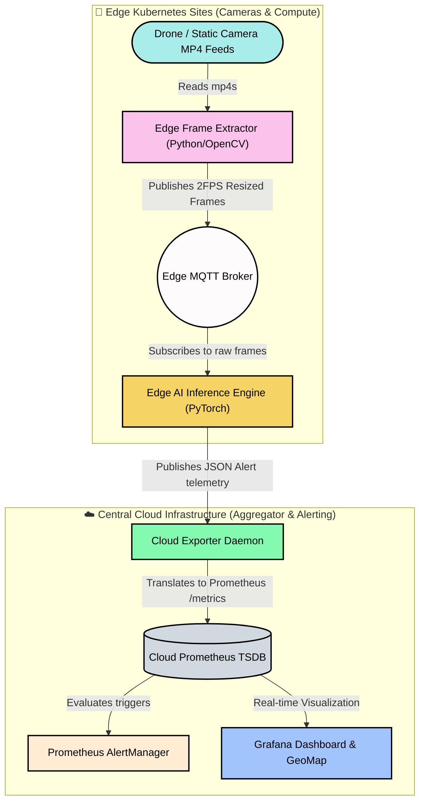

# Distributed Multi-Region Edge Wildfire Detection

This project simulates a highly distributed, **edge-native wildfire detection pipeline** orchestrated on Kubernetes. It was engineered to process massive multi-region video feeds directly at the edge, utilizing deep learning to identify wildfires in real-time, and routing lightweight, geo-tagged telemetry to a centralized Cloud environment. 

This decentralized approach prevents cloud bandwidth saturation and ensures rapid, localized response capabilities without sacrificing centralized visibility.

---

## 🏗 System Architecture

The ecosystem strictly adheres to an Edge-to-Cloud topology, physically mimicking a real-world deployment across vast Vietnamese forests (Đà Lạt, Bạch Mã, Hoàng Liên Sơn).



### 1. Edge Components (`app/edge/`)
Each geographic quadrant deploys an autonomous Edge stack. This isolates processing logic close to the data source.

- **Frame Extractor (`extractor.py`)**: 
  - Simulates physical IoT cameras or drone patrols.
  - Dynamically mounts all `.mp4` video files representing regional feeds.
  - Leverages OpenCV (`cv2`) to extract raw video, rescale the buffers to `224x224` (optimal for our AI), and throttle the feed to exactly `2 Frames Per Second (FPS)`.
  - Publishes the byte-encoded image arrays to localized MQTT topics (e.g., `frames/bachma`).

- **MQTT Broker (`mosquitto`)**: 
  - The ultra-fast, lightweight intra-edge message bus. 
  - Required to orchestrate communication between the Extractor and Inference engines without an external network dependency. 

- **AI Inference Engine (`inference.py`)**: 
  - The brain of the operation. Embedded inside this container is our pre-trained PyTorch checkpoint (`fire_detection_best.pth`).
  - Utilizes `timm` (PyTorch Image Models) to instantly spin up the `EfficientNet-Lite` computer vision architecture.
  - Processes the RGB frames off the MQTT bus at sub-30ms latency.
  - **Geo-Tagging**: Dynamically maps the incoming camera stream (`bachma`, `dalat`, `hoanglienson`) to hardcoded real-world Latitude and Longitude GPS coordinates.
  - **Edge-Throttling**: If a fire is detected with `>70% Confidence`, it converts the frame to `Base64` and dispatches lightweight JSON telemetry over MQTT to the Cloud. However, it suppresses notifications to a maximum of **one alert per 10 seconds per camera** to prevent flood attacks.

### 2. Cloud Components (`app/cloud-monitoring/`)
The centralized environment is strictly responsible for telemetry aggregation, transformation, and high-level visualization.

- **Python Exporter (`exporter/`)**: 
  - Acts as the gateway between the Edge Sites and the Cloud databases.
  - Listens to the `wildfire/alerts` MQTT channels from *all* Edge nodes globally. 
  - Parses the inbound JSON and exposes them as native Prometheus `Gauge` endpoints. 
  - **Dynamic Cool-down Logic**: The Exporter enforces a strict `30-second cooldown block`. If an edge camera detects a continuous fire spanning minutes, instead of spamming Telegram/Prometheus with hundreds of Alerts, the Exporter absorbs the spam, emitting a single `fire_alert_info` metric containing the AI probability, while simultaneously ticking up a dedicated `fire_alert_frames_count` metric used to visually enlarge the blip on the map without firing text alerts.

- **Prometheus & AlertManager (`kube-prometheus-stack`)**: 
  - The industry-standard Kubernetes observability stack.
  - Continuously scrapes the `/metrics` endpoint on the Exporter pod.
  - Evaluates `alerts.yml` rules to trigger critical pagers.

- **Grafana Visualization (`dashboards/fire-detection.json`)**: 
  - Fully bespoke analytics UI.
  - Includes a real-time **Geomap Panel**, dynamically fed global coordinates from the Edge Inference payloads.
  - Maps `fire_alert_frames_count` directly to the `radius` of organic bubbles on the map. As a wildfire persists (count rises), the red circle representing the fire dynamically balloons in size on the Vietnamese map, drawing immediate geographical attention to worsening events.

---

## 🚀 Prerequisites

- An active local Kubernetes orchestrator (Rancher Desktop, Docker Desktop, or Minikube)
- Configured local storage provisioners
- `helm 3.x+`
- `kubectl` 
- Local Docker Daemon 

---

## ⚙️ Quick Start Guide

### 1. Provision the Cloud Monitoring Base
We rely on the standard `kube-prometheus-stack` Helm chart. We'll pass in our custom configuration (`prometheus.yaml`) to auto-provision Grafana, Prometheus, and our custom Alert Rules.

```bash
# Register the Prometheus community repository
helm repo add prometheus-community https://prometheus-community.github.io/helm-charts
helm repo update

# Install the Kube-Prometheus stack combined with our custom values
helm install kps prometheus-community/kube-prometheus-stack -f app/cloud-monitoring/prometheus.yaml

# Push the custom Grafana Geo-Dashboard via ConfigMap
kubectl create configmap grafana-dashboard-json \
  --from-file=fire-detection.json=app/cloud-monitoring/dashboards/fire-detection.json \
  --dry-run=client -o yaml | kubectl apply -f -
```

### 2. Compile the Container Images
The pipeline relies on custom Python applications. You must build these images into your local Docker cache (`--no-cache` recommended during image updates to ensure `.mp4` payloads mount properly).

```bash
# Build the Frame Extractor Image
cd app/edge/node/frame-extractor
docker build -t fire-extractor-python:v2 .

# Build the AI Inference Image
cd ../inference
docker build -t fire-inference-python:v2 .

# Build the Cloud Exporter Gateway Image
cd ../exporter/src
docker build -t fire-exporter:latest .
```

### 3. Deploy the Edge Sites
Deploy the customized Kubernetes Manifests to spin up the entire pipeline. 

```bash
cd ../../../.. # Return to project root

# Spin up internal MQTT
kubectl apply -f app/edge/node/mqtt/

# Spin up Cloud Gateway
kubectl apply -f app/edge/node/exporter/

# Spin up AI Engine & Video Extractor (Order matters for Subscriptions!)
kubectl apply -f app/edge/node/inference/
kubectl apply -f app/edge/node/frame-extractor/
```

### 4. Live Verification

Wait approximately 30-45 seconds for the `EfficientNet` model to bootstrap. Then, observe the Edge AI telemetry in real-time:

```bash
kubectl logs -l app=inference-node -f
```

*(Expected output showing parallel regional evaluation)*
> `[bachma] 🌲 NORMAL conf=0.983 (latency=26.9ms)`
> `[hoanglienson] 🔥 FIRE conf=0.995 (latency=28.3ms)`
> `  -> Dispatched ALERT alert_1773161512_273 payload to wildfire/alerts!`
> `[dalat] 🌲 NORMAL conf=0.953 (latency=17.0ms)`

#### Visualizing the Outbreak
Forward the port to the Grafana loadbalancer to interact with the interactive Geomap and Live Alerts Table:

```bash
kubectl port-forward svc/kps-grafana 3000:80
```
- Navigate to `http://localhost:3000` in your browser.
- Login with the credentials defined in your `prometheus.yaml` (default: `admin`/`prom-operator`).
- Open **Dashboards > Fire Detection Monitoring**.
