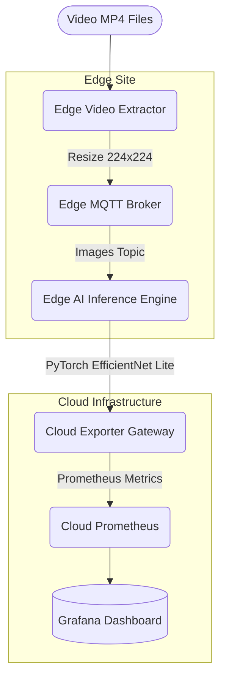

# Distributed Multi-Region Edge Wildfire Detection

This project simulates a highly distributed, edge-native wildfire detection pipeline orchestrated natively on Kubernetes. It was built to process multi-region video feeds directly on localized Edge components and route confidence-scored telemetry to a centralized Cloud environment.

## Architecture

The system is separated into **Edge Pipelines** and **Cloud Monitoring Modules** mimicking a real-world multi-site deployment across various Vietnamese landscapes (Đà Lạt, Bạch Mã, Hoàng Liên Sơn).



### 1. Edge Sites (`app/edge/`)
Each region deploys the following stack locally to preserve bandwidth and latency:
- **Frame Extractor:** Reads continuous `.mp4` payloads representing a drone/camera feed and streams frames at `2 FPS` into the local MQTT broker.
- **MQTT Broker:** A localized Mosquitto message bus to handle high-frequency intra-edge frame transmissions without saturating the Cloud uplink.
- **Inference Engine:** Pulls image topics from MQTT, processes the stream against a quantized `EfficientNet Lite` PyTorch model, cross-references geo-coordinates, and emits lightweight JSON alerts (Confidence > 0.70) when Fire is detected.

### 2. Cloud Components (`app/cloud-monitoring/`)
The centralized cloud environment handles telemetry aggregation, metric transformation, and visualization:
- **Python Exporter:** Custom bridge translating inbound MQTT JSON payloads from **all edge sites** into scraped Prometheus `Gauge` and `Counter` metrics.
- **Prometheus & AlertManager:** Native Kubernetes time-series aggregation deployed via the Kube-Prometheus-Stack Helm chart.
- **Grafana:** Provides an alerting dashboard specifically configured with an interactive Geomap that organically clusters multi-regional outbreaks in real-time.

## Prerequisites
- A local Kubernetes cluster (Docker Desktop, Rancher Desktop, or Minikube)
- Local Path Provisioner active
- Helm 3.x installed
- Kubectl configured

## Setup Instructions

### 1. Deploy the Cloud Monitoring Stack
We rely on the standard `kube-prometheus-stack` to provision Grafana and Prometheus, augmented with our custom alert rules and dashboards.

```bash
# Add prometheus helm repo
helm repo add prometheus-community https://prometheus-community.github.io/helm-charts
helm repo update

# Install monitoring stack combining our custom configuration
helm install kps prometheus-community/kube-prometheus-stack -f app/cloud-monitoring/prometheus.yaml

# Push our geo-dashboard via ConfigMap
kubectl create configmap grafana-dashboard-json --from-file=fire-detection.json=app/cloud-monitoring/dashboards/fire-detection.json -n default -o yaml --dry-run=client | kubectl apply -f -
```

### 2. Build the Edge AI Containers
Before deploying the edge manifests, ensure the local Docker daemon builds the Edge inference and Extractor python applications bundled with the local video assets and PyTorch `pth` models:

```bash
cd app/edge/binhphuoc/frame-extractor
docker build -t fire-extractor-python:v2 .

cd ../inference
docker build -t fire-inference-python:v2 .

cd ../exporter/src
docker build -t fire-exporter:latest .
```

### 3. Deploy the Edge Sites
Launch the Edge workloads to bridge the entire end-to-end pipeline:

```bash
# Apply entire Edge manifest tree
kubectl apply -f app/edge/binhphuoc/mqtt/
kubectl apply -f app/edge/binhphuoc/exporter/
kubectl apply -f app/edge/binhphuoc/inference/
kubectl apply -f app/edge/binhphuoc/frame-extractor/
```

### 4. Verification
Once the pods initialize, stream the logs to ensure frames are successfully dispatched and analyzed across all three geographic region feeds:

```bash
kubectl logs -l app=inference-binhphuoc -f
```

*(Expected output)*
> `[dalat] 🌲 NORMAL conf=0.974 (latency=181.7ms)`
> `[hoanglienson] 🔥 FIRE conf=0.988 (latency=194.0ms)`
> `  -> Dispatched ALERT alert_1773161512_273 payload to wildfire/alerts!`

Forward the Grafana service to securely watch the geographic spread map populate:

```bash
kubectl port-forward svc/kps-grafana 3000:80
```
*(Access `http://localhost:3000` > Search Dashboards > Fire Detection Monitoring)*
